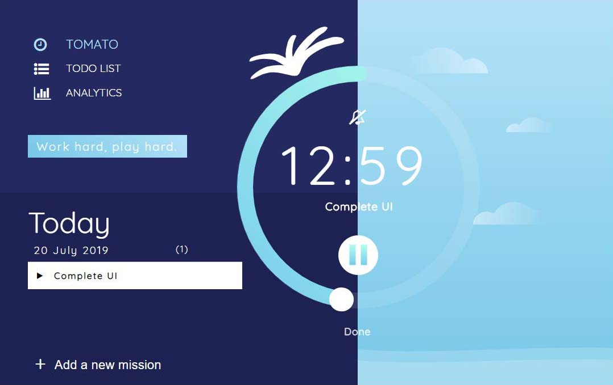
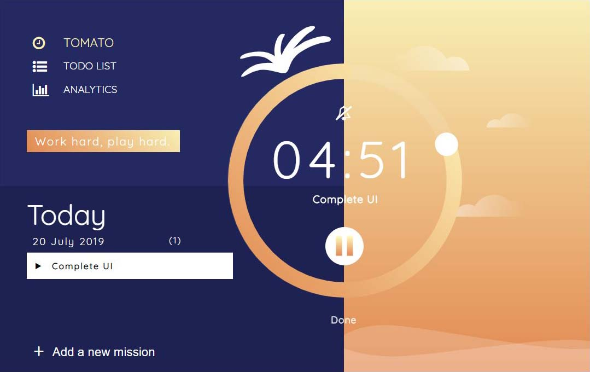
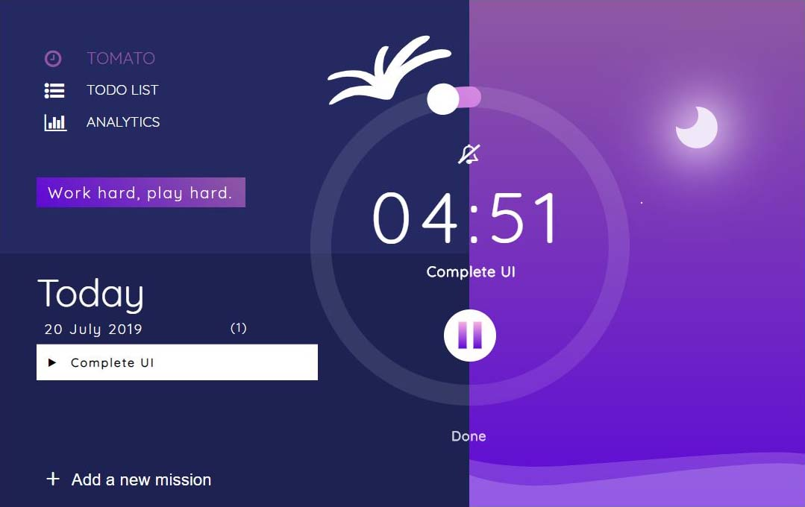

# Pomodoro

2019 : 前端修練精神時光屋挑戰賽 - week 1 - 番茄鐘

> 工作時間 25 分鐘，休息時間 5 分鐘。

## 工作時間 - 白天

## 接近工作時間 - 黃昏 (休息前5分鐘)

## 休息時間 - 夜晚

採用設計 : [Jesshsu](https://challenge.thef2e.com/user/1861?schedule=2495#works-2495)

## 操作方式

一定要建立一個代辦事項才可以加入番茄鐘，直接點擊開始是不會有反應的!

step 1. 在 Add new mission 中輸入代辦事項並按下 `enter` 加入，或按 `+` 號。

step 2. 按下 `播放` 按鈕開始計時。

step 3. 一個30分鐘的循環後可以點選 `Done` 或是 繼續按 `播放` 繼續循環。

step 4. 若按下 `Done` 代辦事項就會被標記為完成，並從列表消失。

### 功能介紹

主要功能為 TOMATO: 番茄鐘計時器，TODO LIST: 代辦列表，ANALYTIC: 分析報表。

#### TOMATO:

能夠加入代辦事項以及開始番茄鐘計時。

#### TODO LIST:

檢視完成清單以及待辦事項清單。

#### ANALYTIC:

查看分析報表，數字為消耗幾顆番茄。

## 需優化

1. localStorage 管理，目前比數沒有上限，預計最多只存100個task
2. 幹話大全
3. 完成清單的番茄顯示
